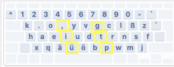
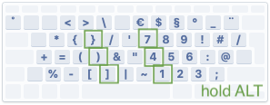

# Ergonomic and efficient custom keyboard layout (with coding symbol layer)
A custom keyboard layout for Mac OS X. Optimized for ergonomics and speed while coding. 
You can switch to the symbol layer by holding the Alt key (option key).

# How to install (Mac OS X)
1. Copy the .keylayout file into your ~/Library/Keyboard Layouts/ folder.
2. Add your new keyboard layout here: System Preferences > Keyboard > Input Sources. Then select it. 
3. Log out and back in to your user account. You can now switch back and forth between the custom and the default layout by clicking on the small flag in menu bar.

# How to modify the layout
Open the .keylayout file with the tool Ukulele and modify it to your liking. https://software.sil.org/ukelele/

